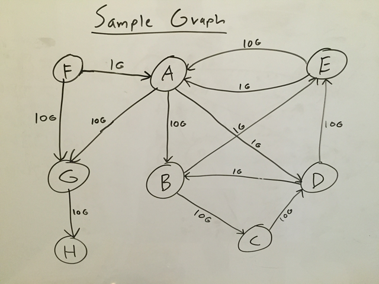

# Minimal Graph Database (MiniGraphDB)

## Synopsis

MiniGraphDB implements a minimal directed graph database in memory via Python3.
Nodes are stored as dictionary data structures. Outgoing relationships are
stored on each node as a nested dictionary nodes[node][__rels] of relationships
with their own properties and pointers to other nodes. Both nodes and
relationships may contain key/value properties, stored in their respective dict
data structures.

## Sample Graph



## Data Structures

### Node data structure

The nodes dict() holds all nodes for each instance of a MiniGraphDB. Each node
in nodes is a dict() itself. New nodes are initialized with an empty
nodes[name]['__rels'] dictionary of outgoing relationships. Each relationship
key in \_\_rels is a tuple of (relationship_name, dstNode).

### Relationship data structure: 

Relationships are stored as dicts and added to the srcNode's __rels dictionary.
Relationship dicts() keep track of __src, __dst and __weight for future
capabilities, but currently the (relationship_name, dstNode) key in __rels
suffices.

### Traversals

MiniGraphDB supports both breadth-first and depth-first traversals across the
graph.

## Usage

To load the sample graph, test queries, as well as run traversal algorithms,
execute ./testmgdb.py on any machine with a Python3.4+ interpreter installed.
There are no dependencies outside the standard libraries.

## Sample Output
```
Loading MiniGraphDB nodes and relationships based on sample graph...[success]

Testing MiniGraphDB with Various Queries and Traversals...

Node A Property "type": db.nodes["A"]["type"]
{ 'Type': 'router'}

Node "A" Property Dump: db.getNodeProps("A")
{ 'model': 'N7700',
  'role': 'core',
  'type': 'router'}

Non-existent Node Property Dump: db.getNodeProps("Z")
Caught Exception: No node named Z found in database

Relationship (D)-[e:1G]->(B) Property Dump: db.getRelProps("1G", "D", "B")
{ 'MTU': '9000'}

Non-existent Relationship (A)-[e:1G]->(C) db.getRelProps(...) Dump:
Caught Exception: Nodes A, C exist in database, but no relationship [1G] exists from A -> C

Outgoing Relationships from A: db.getRelationships(A)
[('10G', 'B'), ('10G', 'G'), ('1G', 'D')]

Outgoing Relationships from E: db.getRelationships(E)
[('10G', 'A'), ('1G', 'A')]

BFS Traversal A -> E on Relationships [10G, 1G]:
(True, [['A', '10G', 'B'], ['B', '1G', 'E']])

DFS Traversal A -> E on any Relationship Type:
(True, [['A', '1G', 'D'], ['D', '10G', 'E']])

BFS Traversal E -> F (orphaned) on any Relationship Type:
(False, [])

BFS Traversal F -> E on any Relationship Type:
(True, [['F', '10G', 'A'], ['A', '10G', 'B'], ['B', '1G', 'E']])

BFS Traversal A -> A on any Relationship Type (always SPF):
(True, [['A', '10G', 'B'], ['B', '1G', 'E'], ['E', '10G', 'A']])

DFS Traversal A -> A on any Relationship Type (path length varies):
(True, [['A', '1G', 'D'], ['D', '1G', 'B'], ['B', '1G', 'E'], ['E', '10G', 'A']])

BFS Traversal A -> A on 10G Links Only:
(True, [['A', '10G', 'B'], ['B', '10G', 'C'], ['C', '10G', 'D'], ['D', '10G', 'E'], ['E', '10G', 'A']])

DFS Traversal A -> A on 1G Links Only:
(True, [['A', '1G', 'D'], ['D', '1G', 'B'], ['B', '1G', 'E'], ['E', '1G', 'A']])

Checking for Loops Starting at F: db.hasloop("F")
(True, ['Path TBD: Found loop around G'])

Checking for Loops Starting at G: db.hasloop("G")
(False, [])

Create new MiniGraphDB Instance (loopdb) A -> B -> C -> B for Testing hasloop()

Checking for Loops Starting at A: loopdb.hasloop("A")
(True, ['Path TBD: Found loop around B'])

Done for now! Please enjoy...
```

## Python Documentation
```
NAME
    mgdb

DESCRIPTION
    MiniGraphDB Python3.4+ module for implementing a minimal Graph Database in
    memory. See the included README.md for more information.

CLASSES
    builtins.object
        MiniGraphDB

    class MiniGraphDB(builtins.object)
     |  MiniGraphDB is a simple implementation of a directed graph of nodes and
     |  relationships (edges and vertices), each with properties, along with both
     |  breadth-first and depth-first traversal algorithms.
     |
     |  Methods defined here:
     |
     |  __init__(self)
     |      Initializes GraphDB, creates nodes dict()
     |
     |  addNode(self, name, props=None)
     |      Adds a node to the database
     |
     |      Inputs: name => Unique name of node
     |              props => Optional node properties dictionary
     |
     |  addRelationship(self, name, srcNode, dstNode, props=None, weight=1)
     |      Adds a relationship 'name' from srcnode to dstnode
     |
     |      Inputs: name => Relationship Name
     |              srcNode => Source Node Name
     |              dstNode => Destination Node Name
     |              weight => Optional Weight Value, defaults to 1
     |
     |  getNodeProps(self, name)
     |      Get the properties for a node as a dict()
     |
     |      Inputs: name => Name of node
     |
     |      Returns: dict() of properties
     |
     |  getRelProps(self, name, srcNode, dstNode)
     |      Get the properties for a relationship as a dict()
     |
     |      Inputs: name => Name of relationship
     |              srcNode => Source Node
     |              dstNode => Destination Node
     |
     |      Returns: dict() of properties
     |
     |  getRelationships(self, name)
     |      Returns list of tuple relationships node (name) has.
     |
     |      Input: name => Name of node
     |
     |      Returns: [(relname, dstNode),{...}]
     |
     |  hasloop(self, startNode)
     |      Calls _traverseBFS with an unreachable endNode, looking for any nodes
     |      that have been visited. If it finds a visited node, there must be a loop.
     |
     |      Input: startNode => Start searching for loops from here
     |
     |      Returns: (bool, [path])
     |
     |  mergeNodeProperties(self, name, props)
     |      Merge node properties dictionary. Updates existing properties if the
     |      exist, or create new ones if they don't
     |
     |      Inputs: name => name of node
     |              props => dictionary of key/values to merge
     |
     |  mergeRelProperties(self, name, srcNode, dstNode, props)
     |      Merge relationship properties dictionary. Updates existing properties if
     |      the exist, or creates new ones if they don't.
     |
     |      Inputs: name => name of relationship
     |              srcNode => Source Node of Relationship
     |              dstNode => Destination Node of Relationship
     |              props => dictionary of key/values to merge
     |
     |  traverse(self, startNode, endNode, allowRels=None, algo='BFS')
     |      Traverse Graph, starting at startNode until endNode is found.
     |      Defaults to a Breadth First Search, but can also perform a
     |      depth first search if desired.
     |
     |      Inputs: startNode => Start Traversal from this node
     |              endNode => Search for path to endNode
     |              allowRels => Optional List of relationship names to traverse
     |                           None traverses all relationship names
     |              algo => Type of search (BFS, DFS), defaults to BFS
     |
     |      Returns: tuple (found (bool), path (dict))
     |
     |  ----------------------------------------------------------------------
```

## Motivation

MiniGraphDB was written to explore what would be required to create a Graph
Database from scratch in Python3 using the standard libraries, with no prior
knowledge about how a Graph Database should be implemented. It should be used
for understanding potential implementations of Graph Databases only, and is not
considered production ready. MiniGraphDB was written for clarity and
understanding over performance.

## Expandibility of MiniGraphDB

MiniGraphDB could be easily expanded in many ways. Here are a few examples.

### Storing the Graph to Disk

Using the standard pickle module, a GraphDB object
could be saved to disk, and then recovered at the next runtime. This would not
be the most efficient storage method, but for the purposes of this program, it
should suffice.

### Custom Exceptions

Currently, all exceptions are generic. Specific Exceptions should be added for
cases such as NoNodeFound or NoRelationshipFound.

### Proper Test Suite

MiniGraphDB could include py-tests to unit tests as well as larger tests on the
database overall, but this would require installing modules outside of the
standard libraries.

### Undirected Traversals

It should be easy to reverse the graph traversal direction as well as add
direction-less graph traversal by adding an __inrels dictionary to each node to
keep track of all incoming relationships. The traversal algorithms could be
modified to traverse in either/both directions.

### Weighted Traversals

Traversals could take into account the __weight variable of relationships to
implement a version of Dijkstra's algorithm.

### All Shortest Paths Traversal

Combining an implemetation of Dijkstra's algorithm above, a special type of
traversal could be created to return all shortest paths, instead of only the
first path found.

### hasloop() Path Representation

Currently hasloop() only detects a loop, and does not return the loop structure.
_traverseBFS() could be modified to return the found loop with a recursive call
to _traverseBFS() from startNode to the node the loop was found around, as well
as a _traverseBFS() call where startNode and endNode are equal to the node the
loop was found around.

### Merge Methods

Adding mergeNode and mergeRelationship would create or merge existing nodes
and/or relationships along with updating/adding properties to nodes and
relationships.

### Where Clauses

Traversal algorithms could be modified to check whether properties on
nodes/relationships meet certain criteria, such as (==, !=, <, >, =~, etc).

### Adopt the Cypher Query Lanuage

It's possible to implement a subset of the Cypher query language to allow for
easier graph queries. Cypher is a friendly graph query language used by Neo4j,
and is available open-source for all implementation of Graph Databases: [Open
Cypher](http://www.opencypher.org)

### REST API

A REST API could be added via Flask to allow remote inserts into the database as
well as returning all queried data as JSON.

### Optimization

It's possible to cache traversals on graphs that do not change often. This could
be accomplished with the @functools.lru_cache decorator along with a call to
invalidate the cache as the graph changes. While there are many avenues of
optimization, none would add clarity to MiniGraphDB, which was the primary goal
of this implementation.

## Contributors
* Jonathan Yantis ([yantisj](https://github.com/yantisj))

## License
NetGrph is licensed under the GNU AGPLv3 License.
